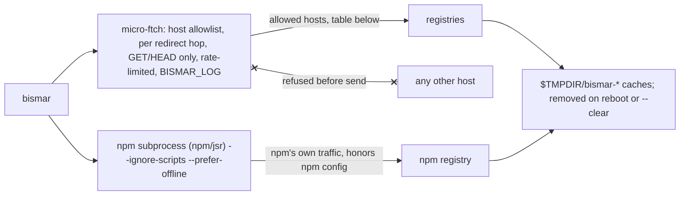

# bismar

> Browse, weigh, and diff packages from any registry

A bismar is the old Viking hand scale for weighing goods. This one works with
npm, jsr, crates.io, rubygems, pypi, packagist, github, gitlab, and
the go proxy; allowing to:

1. Browse code in interactive keyboard-friendly navigator
2. Compare diffs between different versions
3. Download files
4. Easily use tool output in machine-friendly non-TTY env

For JS, bismar can also bundle and minify specific exports, with tree shaking.

Used by [noble cryptography](https://paulmillr.com/noble/) to ensure bundles stay small.

## Usage

> `npm install bismar` — or, without installing, `npx bismar js:preact -bs` from
> any directory

```
usage:
  bismar [<selector>] [--bundle] [--minify] [--size] [--list]
  bismar [-bms] [<selector>]
  bismar --diff <a> <b>

flags:
  <no flag>     open interactive navigator
  -b, --bundle  emit a single-file bundle (JS) / archive (non-JS)
  -m, --minify  (JS only) emit the minified bundle
  -s, --size    list shipped file size stats
      -bs       (JS) bundle sizes
      -bsm      (JS) bundle sizes, minified+gzipped
  -d, --diff    interactive comparison between 2 selectors
      -ds       non-interactive size stats for all files
      -dbs      (JS) diff of bundle sizes
      -dbsm     (JS) diff of bundle sizes, minified+gzipped
  -l, --list    list all public exports
      --clear   clean-up bismar cache
```

### Examples

```sh
bismar js:@noble/hashes           # vim-like pager
bismar rs:serde
bismar gem:sinatra/README.md
bismar gh:@paulmillr              # user repos
bismar gem:sinatra/lib/sinatra.rb > s.rb

bismar -l npm:micro-ftch

bismar -b js:qr > qr.js
bismar -b rs:serde > serde.cargo
bismar -bm js:qr > qr.min.js

bismar -s js:chokidar
bismar -bs npm:micro-ftch
bismar -bsm npm:micro-ftch

bismar -d js:qr@0.5 js:qr@0.6
bismar -ds npm:readdirp@{4,5}
bismar -dbs npm:readdirp@{4,5}
bismar -dbsm npm:readdirp@{4,5}

# hint: non-terminal (non-TTY) emits DIFFERENT, machine-friendly output
bismar -d npm:micro-ftch@{1.0,1.1} | head
bismar -bsm npm:react | sort -t, -k4 -rn
```

### Selectors & namespaces

```
selectors (package / ref / dir / archive):
  npm:qr, npm:qr@0.6, gem:sinatra, ../sinatra, ./qr.tar.bz2

namespaces ("short: long"; both versions work):
  js:   npm         py:   pypi
  jsr:  jsr         php:  packagist
  rs:   crate       gh:   github
  rb:   gem         go:   go proxy
  gitlab: gitlab
```

## Security



- **Read-only traffic**: GET, plus one HEAD (tarball-size garnish, one-byte
  range-GET fallback). bismar never POSTs; `--no-audit` removes npm's one
  routine POST too.
- **Host allowlist, enforced pre-send**: only the origins below are reachable.
  Redirects are followed one checked hop at a time, so a registry answer can't
  bounce a request elsewhere — not even as a probe the blocked host would see.
  Download URLs read from registry metadata are origin-confined besides:
  packagist dists must be github zipballs, pypi artifacts must live on
  pythonhosted.
- **No code execution**: npm runs `--ignore-scripts`; bundling and measuring
  are static esbuild work; non-JS packages are never executed or bundled.
- **Big downloads ask first**: 100mb+ needs a terminal confirmation
  (`BISMAR_BIG=1` for scripts and CI); off a terminal it is refused.
- **Disposable caches**: everything lives under `$TMPDIR/bismar-*`, OS-cleaned
  after reboot; `bismar --clear` wipes it now. Pinned versions cache until
  reboot, floating "latest" for 15 minutes.
- **Knobs**: `BISMAR_LOG=file.txt` logs every request, one line each;
  `BISMAR_RPS` tunes the polite request budget (`0` disables); overriding a
  `BISMAR_*` base admits that origin in place of the default.

| host                           | used for                                            |
| ------------------------------ | --------------------------------------------------- |
| registry.npmjs.org             | npm search, profiles, packed-size garnish           |
| npm.jsr.io                     | jsr metadata + tarballs (jsr's npm-compat registry) |
| api.jsr.io                     | jsr search, scope profiles                          |
| crates.io (→ static.crates.io) | crate metadata, downloads, search, profiles         |
| rubygems.org                   | gem metadata, downloads, search, owner profiles     |
| pypi.org                       | pypi metadata                                       |
| files.pythonhosted.org         | pypi artifact downloads                             |
| repo.packagist.org             | composer p2 metadata                                |
| packagist.org                  | composer vendor profiles                            |
| api.github.com                 | gh api, search, profiles; composer dist zipballs    |
| codeload.github.com            | gh archive downloads; composer dist zipballs        |
| gitlab.com                     | gitlab api, search, profiles, archives              |
| proxy.golang.org               | go module metadata + zips                           |

Three deps are used: esbuild and micro-ftch are pinned, and the syntax
highlighter is vendored and bundled with the package, so none can update
underneath a release.

## License

MIT License (c) 2026 Paul Miller [(https://paulmillr.com)](https://paulmillr.com)
